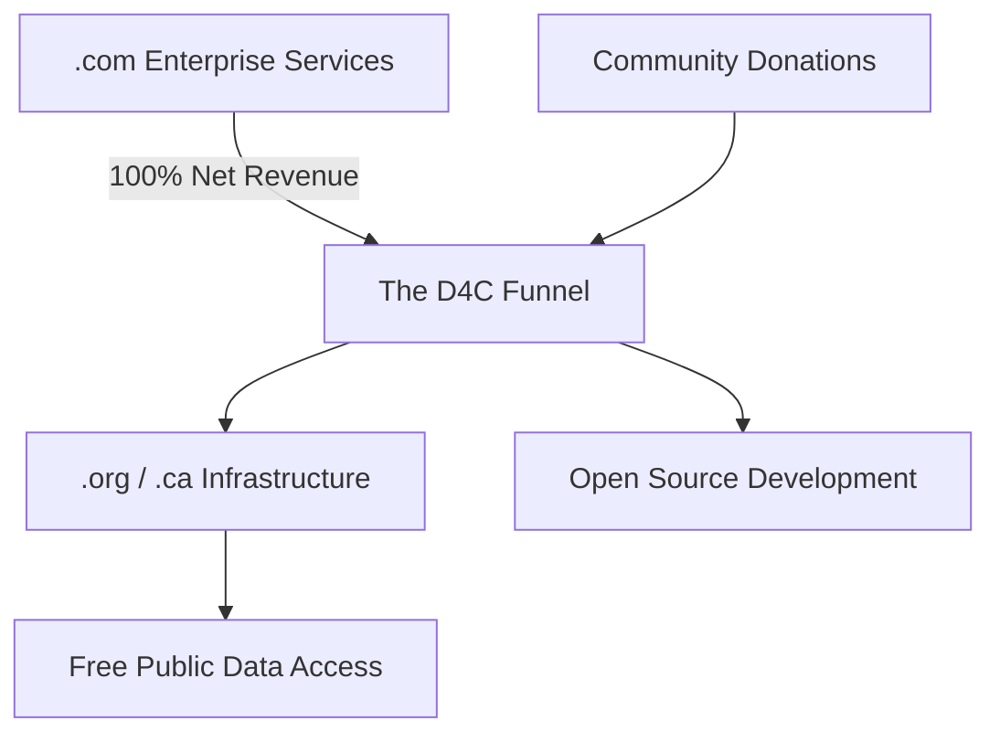

# d4c-financials: Radical Transparency Ledger

Welcome to the central financial repository for **Data for Canada**.

In alignment with our mission to provide open, accessible, and decentralized geospatial data for all Canadians, we believe our funding and expenditures should be held to the same rigorous standards as our datasets. This repository serves as our **Public Financial Ledger**, providing transparency into the project's sustainability and growth.

## ⚖️ Our Philosophy: Radical Transparency

We operate on the principle of **Open-Book Accounting**. This means:

* **Cloud-Native Ledger:** Our financials are stored in **Apache Parquet** format. This allows for high-performance, columnar analysis of our spending patterns and ensures our financial data is as technically modern as our geospatial data. The `ledger.parquet` file is indexed via our [FAIR Data Catalogue](https://stac-utils.github.io/stac-geoparquet/latest/spec/stac-geoparquet-spec/) and shared across our peer-to-peer network to ensure the record exists independently of any single hosting provider.
* **Live Visibility:** Every donation received and every cent spent is recorded as quickly as we can get the invoices out of systems.
* **Version-Controlled History:** Because this is a Git repository, the entire history of our financial state is immutable and verifiable through Git commits.

## 🔄 The Funding Funnel

**Data for Canada** utilizes a sustainable "Social Enterprise" model to maintain independence from volatile grant cycles:

1. **Enterprise Services (`.com`):** High-availability products targeting the enterprise GIS market (e.g., Esri and other enterprise competitors) are hosted at **dataforcanada.com**.
2. **The Funnel:** 100% of the net revenue generated from these commercial services is funneled directly into our community infrastructure.
3. **Community Impact (`.org` / `.ca`):** These funds power the free, decentralized data mirrors and open-source tools hosted at **dataforcanada.org** and **dataforcanada.ca**.



## 📊 Ledger Structure

The financial data in this repo is consolidated into a single, high-efficiency file to facilitate easy querying and integration with BI tools or Python/R notebooks:

* **`ledger.parquet`**: The master record of all inflows and outflows.
* **Schema includes:** `timestamp`, `category`, `source`, `amount_cad`, `original_amount`, `currency_code`, `description`, `transaction_id`, **`proof_link`** (ex. Link to the Open Collective expense or receipt), `hash`.

## 🤝 Community-Based Funding

We use **Open Collective** as our primary fiscal engine. This allows for:

* **Public Accountability:** You can see our real-time balance and every transaction as it happens.
* **Neutral Stewardship:** Funds are managed through a fiscal host to ensure professional and ethical handling of all contributions.

### 🛠️ Verification & Analysis 
To maintain the integrity of this ledger, we provide a basic Python snippet for community members to verify the `ledger.parquet` file locally:
```python
import pandas as pd
df = pd.read_parquet('ledger.parquet')
# Calculate total community-funded infrastructure spend
print(df[df['category'] == 'Infrastructure']['amount_cad'].sum())
```

### 🛡️ Privacy Note

While we strive for total transparency, we respect the privacy of our individual donors. Contributions can be made anonymously, and we redact personal identification from any public records in compliance with the highest privacy ethics.
